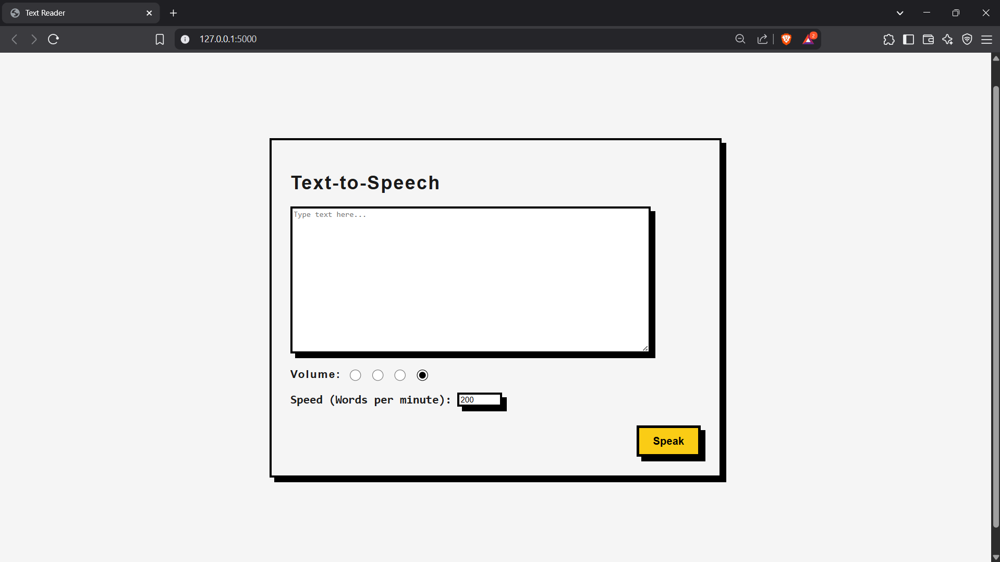

# Text-Reader
A Text-to-Speech Web App

A beautifully styled Text-to-Speech (TTS) web app with a Neo-Brutalist UI built using **Flask** and **JavaScript**.
---

## ⚙️ Features

- 🎤 Convert text into speech
- 🔊 Adjustable **volume** via radio buttons
- 🚀 Adjustable **speech rate**
- 🖤 Dark Mode support
- 💬 Modern Neo-Brutalist UI

---

## 📸 Preview

 <!-- Add screenshot of your app -->

---

## 🛠️ Installation

### 1. Clone the repository

```bash
git clone https://github.com/your-username/Text-Reader
```

### 2. Install dependencies

```bash
pip install flask pyttsx3
```
### 3. ▶️ Run the Flask App

```bash
python app.py
```
And open
```
http://localhost:5000
```

🧪 Technologies Used

---Flask (Backend)

---HTML/CSS + JavaScript (Frontend)

---pyttsx3

---Neo-Brutalist CSS styling

tts-web-app/
├── templates/
│   └── index.html         # Main web UI
├── app.py                 # Flask app
├── README.md
└── requirements.txt       # Python dependencies

 🙋‍♂️ Author
---
Created by Tanmay Shimpi

