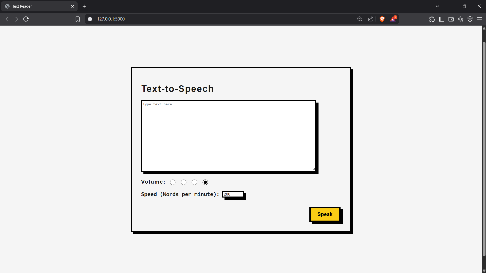

# Text-Reader
A Text-to-Speech Web App

A beautifully styled Text-to-Speech (TTS) web app with a Neo-Brutalist UI built using **Flask** and **JavaScript**.

---

## 🌐 Live Demo

👉 [Try it out here](https://text-reader.tanmay.fun/)

---

## 🔧 Features

- 🗣️ Text-to-Speech using:
  - ✅ Server-side TTS (`pyttsx3` via Flask)
  - ✅ Browser-side TTS (Web Speech API)
- 🔊 Adjustable **volume** via radio buttons
- 🚀 Adjustable **speech rate**
- 🖤 Dark Mode support
- 🔄 Toggle between **Server TTS** and **Browser TTS**
- 🧠 Smart fallback: browser remembers your preferred TTS mode

---

## 📸 Preview

 <!-- Add screenshot of your app -->

---

## 🛠️ Installation

### 1. Clone the repository

```bash
git clone https://github.com/your-username/Text-Reader
```

### 2. Install dependencies

```bash
pip install flask pyttsx3
```
### 3. ▶️ Run the Flask App

```bash
python app.py
```
And open
```
http://localhost:5000
```
---
🧪 Technologies Used

---Flask (Backend)

---HTML/CSS + JavaScript (Frontend)

---pyttsx3

---Neo-Brutalist CSS styling

---

 🙋‍♂️ Author
---
Created by Tanmay Shimpi

